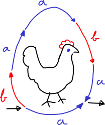

.. Copyright (c) 2021, J. D. Mitchell + Maria Tsalakou

   Distributed under the terms of the GPL license version 3.

   The full license is in the file LICENSE, distributed with this software.

step_hen - Version 0.0.3
========================

``step_hen`` contains a rudimentary implementation of two algorithms of J. B.
Stephen :cite:`Stephen1987aa` and :cite:`Stephen1990aa` and one of Andrew
Cutting :cite:`Cutting2001aa` for finitely presented monoids and inverse
monoids in python3. These algorithms can be used to check equality of a
fixed word with any other word in a finitely presented monoid, or inverse
monoid, and to compute the structure of a finitely presented inverse monoid. 

``step_hen`` was written by `James D. Mitchell <jdbm.me>`_ and `Maria
Tsalakou <mariatsalakou.github.io>`_. The development repo is on `GitHub
<https://github.com/james-d-mitchell/step_hen>`_.

The implementation is rudimentary because it lacks many obvious optimisations
and improvements, it is intended as a simple proof of concept.

.. toctree::
   :maxdepth: 1

   changelog

.. toctree::
   :maxdepth: 2
   :caption: Contents:

   presentation
   wordgraph
   schutzenbergergraph 
   stephen
   biblio

Indices and tables
==================

* :ref:`genindex`
* :ref:`modindex`
* :ref:`search`
